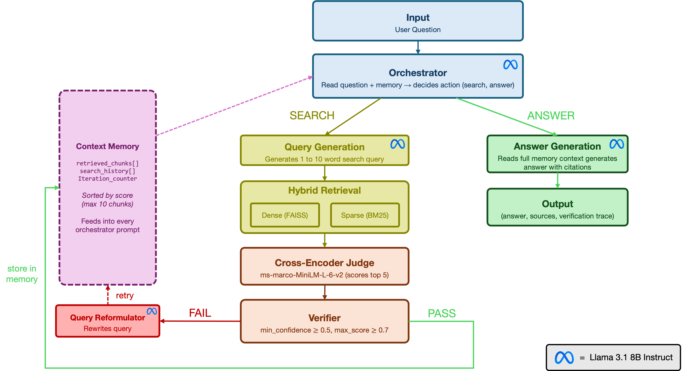

<div align="center">
    <h1>PROBE</h1>
    <i>Iterative Retrieval Agent for Multi-Hop Embedded System Questions</i>
</div>

---

## Overview



## Structure

```
PROBE/
├── corpus/
│   ├── datasheets/     ← plain text datasheet files
│   └── eval/           ← TechQA and EMQAP datasets
├── index/demo/         ← retrieval index
├── experiments/        ← evaluation
├── results/            ← evaluation output
├── components/         ← all system modules
├── app.py              ← demo
```
